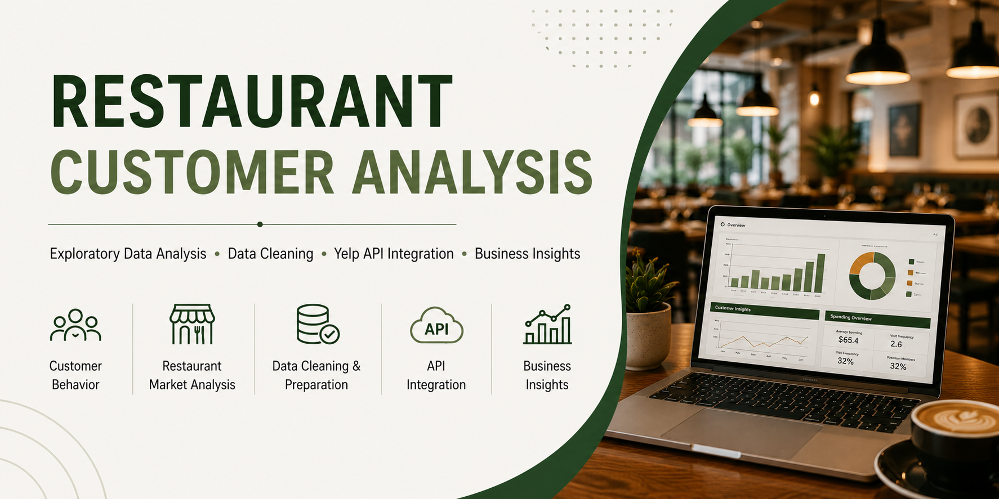
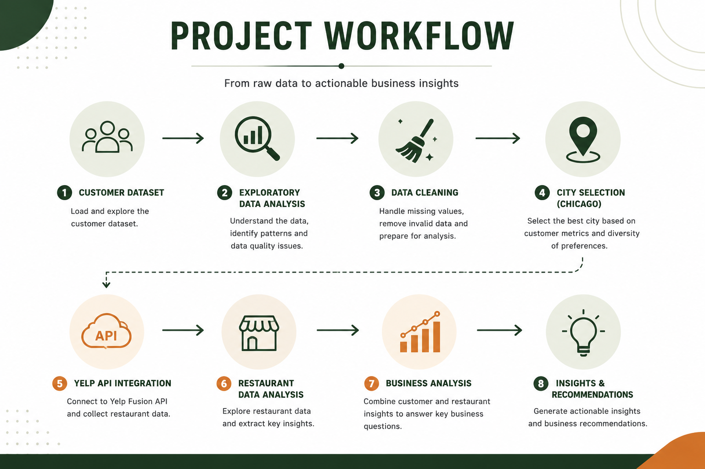
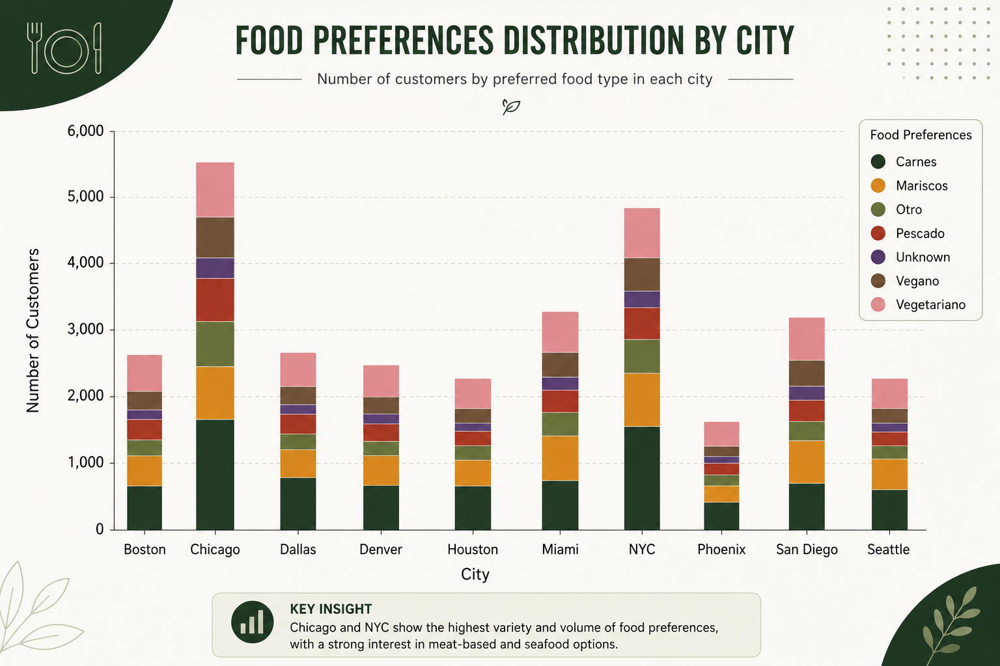

# 🍽️ Restaurant Customer Analysis




> **Exploratory Data Analysis, Data Cleaning, Customer Segmentation & Yelp API Integration**

A complete data analysis project focused on understanding customer behavior in the restaurant industry by combining internal customer information with external restaurant data obtained through the **Yelp Fusion API**.

The project follows a complete analytical workflow including **data exploration**, **data cleaning**, **business analysis**, **API integration**, and **data-driven business recommendations**.

---

## 📌 Project Overview
This project was developed as part of the SoyHenry Data Analytics program.

The objective was to analyze restaurant customer behavior, improve data quality through data cleaning techniques, and enrich the analysis by integrating real-time restaurant information from the **Yelp Fusion API**

The project follows a complete analytics workflow, from raw data exploration to business recommendations supported by visualizations and external data sources.

---

# 📁 Dataset

This project uses a customer dataset provided as part of the **SoyHenry Data Analytics Program**.

The dataset contains approximately **30,000 customer records** and **17 variables**, including:

- Customer demographics
- Monthly income
- Restaurant spending
- Visit frequency
- Food preferences
- Premium membership status
- City of residence

After the exploratory analysis, the dataset was cleaned according to predefined business rules and exported as **customers_clean.csv**, which served as the foundation for the subsequent stages of the project

---
## 🎯 Business Problem

---

The company wants to better understand:

- Which cities represent the most valuable customer markets.
- How customer spending varies across different cities.
- Whether restaurant availability aligns with customer preferences.
- Which restaurant characteristics may influence customer behavior.
- How external restaurant information can improve business decision-making.

---

# 📂 Project Structure

```text
restaurant-customer-analysis/

│
├── data/
│   ├── base_datos_restaurantes_USA_v2.csv
│   └── customers_clean.csv
│
├── notebooks/
│   ├── 01_Advance_EDA.ipynb
│   ├── 02_Advance_API_Yelp.ipynb
│   └── 03_Advance_Business_Analysis.ipynb
│
├── README.md
├── requirements.txt
└── .gitignore
```

---

# 🚀 Project Workflow



---

# 🔍 Project Methodology

The project was developed in three stages.

## 📊 Advance 1 — Exploratory Data Analysis

- Dataset exploration
- Data quality assessment
- Missing value analysis
- Business rule validation
- Data cleaning
- Export of cleaned dataset
- Objective city selection

---

## 🌎 Advance 2 — Yelp API Integration

- Authentication using API Key
- REST API consumption
- JSON manipulation
- Data extraction
- Restaurant exploratory analysis
- Integration with customer analysis

---

## 📈 Advance 3 — Business Analysis

Business visualizations answering questions such as:

- Customer distribution by city
- Socioeconomic segmentation
- Average restaurant spending
- Visit frequency analysis
- Monthly income vs spending
- Food preferences
- High-value customer profiling
- Premium membership analysis
- Alcohol consumption by age

---

# 🧹 Data Cleaning

Several data quality issues were identified before the analysis.

Cleaning actions included:

- Replacing invalid ages with missing values
- Removing invalid visit frequencies
- Median imputation for restaurant spending
- Missing dietary preferences replaced with **Unknown**
- Preserving non-relevant missing values (phone and email)

Every cleaning decision was documented and supported by business rules before implementation.

---

# 📡 Yelp API Integration

The project uses the **Yelp Fusion API** to enrich internal customer information with external restaurant data.

Information collected includes:

- Restaurant names
- Categories
- Ratings
- Review count
- Price level
- Geographic location

This information was integrated into the business analysis to better understand the restaurant market surrounding the selected customer base.

---

# 📊 Key Findings



### 📍 Chicago was selected as the study city

Chicago combines:

- One of the largest customer populations
- The highest number of Premium members
- High diversity of food preferences

making it the strongest candidate for the second stage of the analysis.

---

### ⭐ Restaurant Quality

Most restaurants retrieved from Yelp have ratings between **4.3** and **4.5**, indicating a highly competitive restaurant market.

---

### 💲 Restaurant Pricing

The majority of restaurants belong to the **Medium** and **High** price categories.

---

### 🍴 Restaurant Categories

The most common restaurant categories include:

- New American
- Breakfast & Brunch
- Cocktail Bars

---

### 👥 High Value Customers

High-spending customers:

- Frequently hold Premium memberships
- Show diverse food preferences
- Spend significantly above the dataset average

---

# 💡 Business Recommendations

Based on the analysis, the following recommendations are proposed:

- Increase Premium membership adoption in cities with large customer populations.
- Develop personalized marketing campaigns according to customer spending behavior.
- Expand restaurant recommendations based on customer food preferences.
- Promote medium- and high-value restaurant experiences to customers with greater purchasing power.
- Continue strengthening loyalty programs for high-value customers.

---

# 🛠 Technologies Used

- Python
- Pandas
- NumPy
- Matplotlib
- Jupyter Notebook
- REST APIs
- JSON
- Git
- GitHub

---

# 📚 Skills Demonstrated

- Exploratory Data Analysis (EDA)
- Data Cleaning
- Feature Validation
- Business Analysis
- Data Visualization
- REST API Integration
- JSON Processing
- Customer Segmentation
- Business Storytelling
- Technical Documentation

---

# 🔮 Future Improvements

Possible future extensions include:

- Interactive dashboard using **Power BI**
- SQL database integration
- Predictive Machine Learning models
- Customer clustering
- Restaurant recommendation system
- Automated data pipeline

---

# 📄 License

This project is licensed under the **MIT License**. See the [LICENSE](LICENSE) file for more information.

# 👨‍💻 Author

---

**David Alejandro Cuastumal Bucheli**

Data Analytics - Data Science 

---

> *"Turning raw data into meaningful business decisions through analytics."*