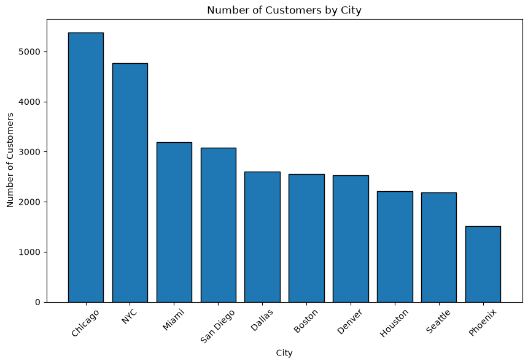
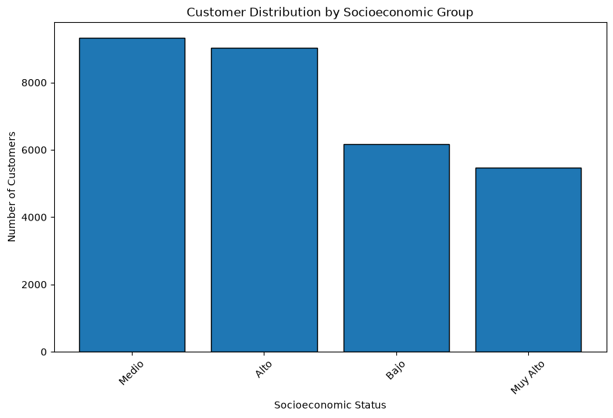
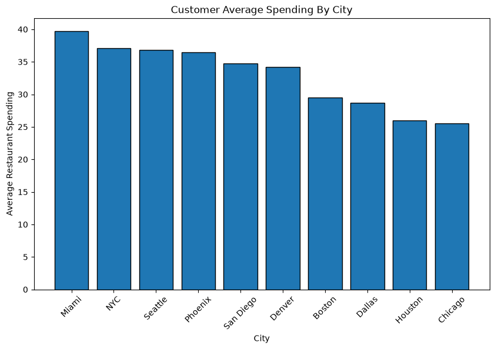
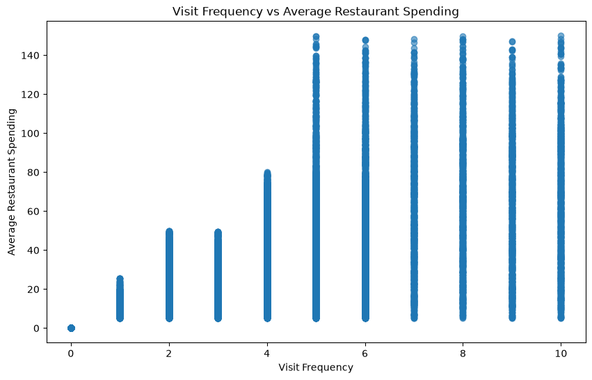
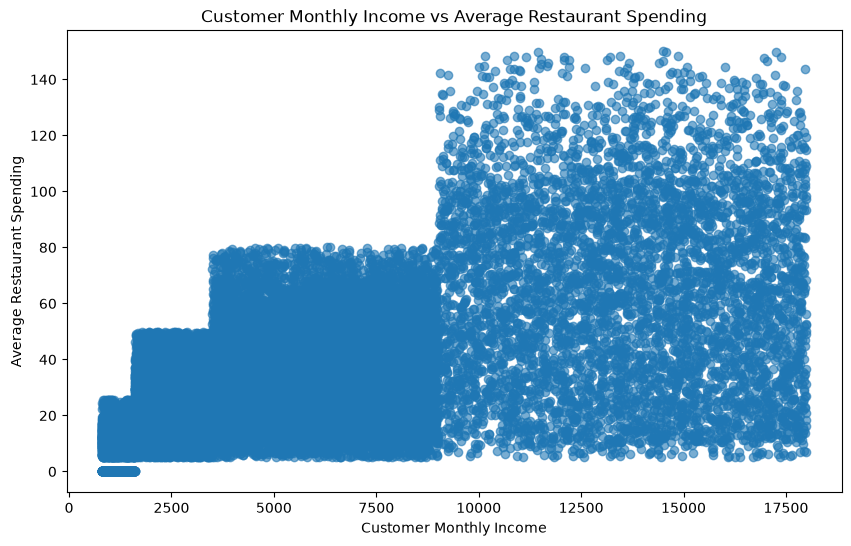
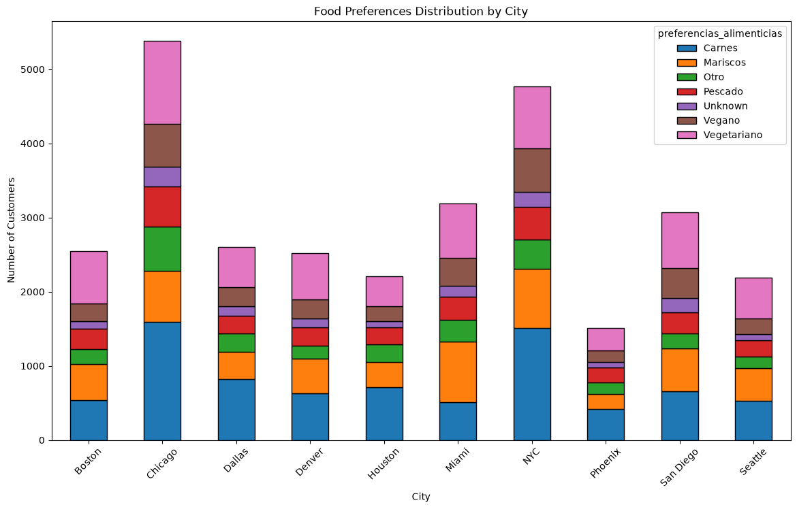
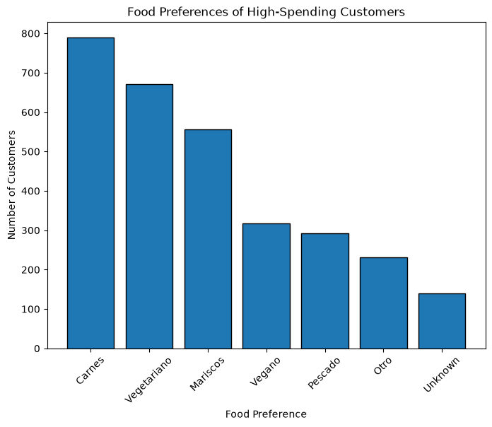
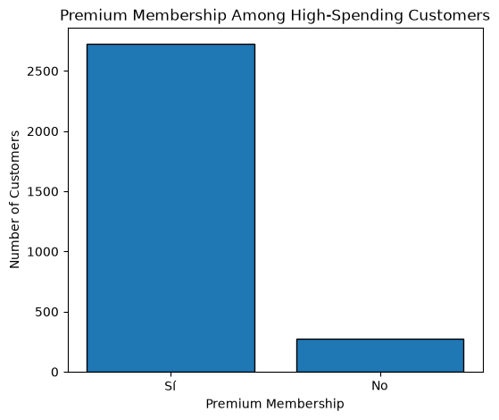
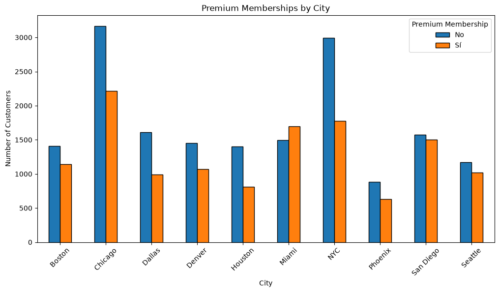
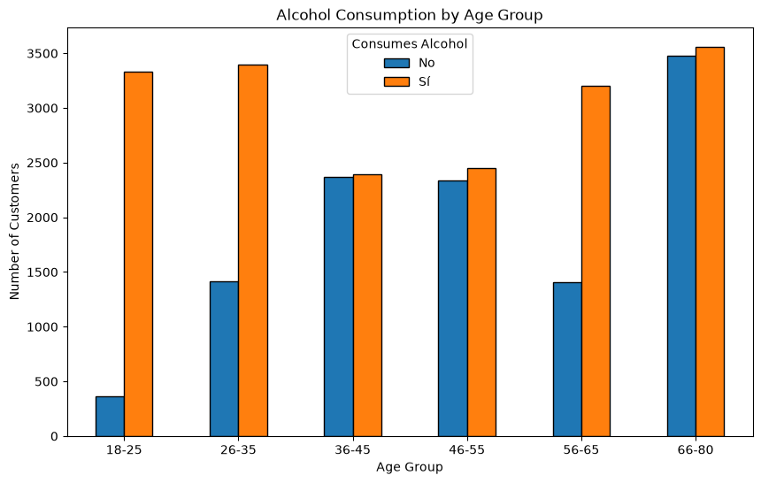

# 🍽️ Restaurant Customer Analysis

# Executive Business Report

This report presents the final business findings obtained from the Restaurant Customer Analysis project developed as part of the SoyHenry Data Analytics Program.

Unlike the technical documentation included in the main project repository, this report focuses on explaining the business value of the analysis, allowing both technical and non-technical stakeholders to understand the results and recommendations without reviewing the source code.

The analysis combines internal customer information with external restaurant data obtained through the Yelp Fusion API, providing a broader understanding of customer behavior and the restaurant market in the selected city.

---

# 📌 Executive Summary

The main objective of this project was to analyze restaurant customer behavior and identify business opportunities through data-driven decision making.

The project followed a complete analytics workflow beginning with exploratory data analysis and data cleaning, followed by the integration of external restaurant information using the Yelp Fusion API. Finally, business visualizations were developed to identify customer segments, spending patterns, food preferences, and restaurant characteristics that may influence customer engagement.

The analysis identified Chicago as the most representative city for the project due to its large customer base, high number of Premium members, and diverse restaurant ecosystem.

The insights generated throughout the project support strategic decisions related to customer segmentation, personalized marketing campaigns, restaurant recommendations, and loyalty program optimization.

---

# 🎯 Business Objectives

The analysis was designed to answer the following business questions:

- Which cities represent the largest customer markets?
- Which customer groups generate the highest business value?
- How does restaurant spending vary across cities?
- Are Premium members associated with higher spending?
- What are the most common customer food preferences?
- How can external restaurant information improve business understanding?
- Which business actions could increase customer engagement and revenue?

---

# 📁 Dataset Overview

The project uses a customer dataset provided as part of the SoyHenry Data Analytics Program.

The dataset contains approximately **30,000 customer records** including:

- Customer demographics
- Monthly income
- Restaurant spending
- Visit frequency
- Food preferences
- Premium membership
- Alcohol consumption
- City of residence

Before beginning the business analysis, the dataset was cleaned according to predefined business rules to improve data quality and ensure reliable results.

---

# 🔄 Project Methodology

The analytical workflow was organized into five main stages, each contributing to the final business insights.

## 1. Exploratory Data Analysis (EDA)

The original dataset was explored to understand its structure, identify missing values, detect invalid records, and evaluate overall data quality.

---

## 2. Data Cleaning

Invalid ages, negative visit frequencies and missing values were treated according to documented business rules to improve the reliability of the dataset.

---

## 3. Yelp API Integration

Restaurant information was collected using the Yelp Fusion API, allowing the customer dataset to be enriched with restaurant ratings, categories, prices, popularity, and geographic information.

---

## 4. Business Analysis

Several visualizations were developed to better understand customer behavior, spending habits, restaurant preferences, and Premium membership adoption.

---

## 5. Business Recommendations

The project concludes with actionable recommendations supported by the analytical findings.

---

# 📊 Business Analysis

## Customer Distribution by City

### Analysis

Chicago represents the largest customer market within the dataset, followed closely by New York City. Together, these two cities account for a significant proportion of the customer population.

Phoenix contains the smallest customer base, indicating lower market penetration compared to the remaining cities.

The distribution suggests that customer demand is concentrated in a small number of metropolitan areas.

### Business Impact

Cities with larger customer populations provide greater opportunities for customer retention, marketing campaigns, and Premium membership growth.

### Recommendation

Prioritize customer acquisition and retention strategies in Chicago and New York while evaluating whether smaller markets require localized marketing campaigns or additional restaurant partnerships.

---

## Customer Distribution by Socioeconomic Group

### Analysis

Most customers belong to the Middle and High socioeconomic groups, while fewer customers are classified within the Low and Very High income segments.

This indicates that the primary customer base has moderate to strong purchasing power, making them suitable candidates for restaurant promotions and loyalty programs.

### Business Impact

Marketing strategies focused on middle- and high-income customers are likely to generate greater returns because these segments represent the majority of the customer population.

### Recommendation

Develop personalized promotions targeted toward medium- and high-income customers while designing premium experiences for higher-income segments.

---

## Average Restaurant Spending by City

### Analysis

Although Chicago contains the largest customer population, Miami reports the highest average restaurant spending per customer.

New York City, Seattle and Phoenix also demonstrate relatively high spending levels, whereas Chicago and Houston show lower average spending despite having substantial customer populations.

This finding suggests that customer volume does not necessarily translate into higher individual spending.

### Business Impact

Cities with high average spending may generate greater revenue per customer, making them attractive markets for premium restaurant experiences and personalized offers.

### Recommendation

Expand premium marketing initiatives in Miami and New York while investigating opportunities to increase customer spending in Chicago through loyalty programs and personalized recommendations.

---

## Visit Frequency vs Average Restaurant Spending

### Analysis

Customers who visit restaurants more frequently generally exhibit a wider range of restaurant spending.

Although spending varies considerably, higher visit frequencies are associated with increased opportunities for larger customer lifetime value.

Frequent restaurant visitors represent an important customer segment for retention strategies.

### Business Impact

Increasing visit frequency may generate higher long-term revenue without necessarily requiring significant customer acquisition efforts.

### Recommendation

Implement loyalty rewards and personalized incentives that encourage customers to visit restaurants more frequently.

---

## Customer Monthly Income vs Average Restaurant Spending

### Analysis

The relationship between monthly income and restaurant spending reveals that customers with higher incomes generally have access to a wider spending range. However, the distribution also indicates that high income alone does not guarantee higher restaurant expenditure.

Several customers with similar income levels exhibit different spending behaviors, suggesting that additional factors such as personal preferences, visit frequency, and Premium membership may also influence restaurant spending.

### Business Impact

Income is an important indicator for customer segmentation, but it should not be used as the only variable when designing personalized marketing campaigns.

### Recommendation

Combine income information with visit frequency, Premium membership, and food preferences to build more accurate customer segmentation models.

---

## Food Preferences Distribution by City

### Analysis

Food preferences vary considerably across cities, although meat-based cuisine remains the most popular option in nearly every location.

Chicago and New York City display the greatest diversity of food preferences due to their larger customer populations. Vegetarian and vegan preferences also represent significant customer segments, indicating an opportunity for restaurants offering specialized menus.

The presence of multiple preference categories demonstrates that restaurant recommendations should be personalized rather than standardized.

### Business Impact

Understanding customer food preferences enables businesses to improve restaurant recommendations, increase customer satisfaction, and deliver more relevant marketing campaigns.

### Recommendation

Develop recommendation systems that prioritize restaurants according to each customer's dietary preferences while promoting greater menu diversity across restaurant partnerships.

---

## Food Preferences of High-Spending Customers

### Analysis

Among customers with the highest restaurant spending, meat-based cuisine remains the dominant preference, followed by vegetarian and seafood options.

This indicates that high-value customers are not concentrated within a single dietary group, although some categories generate greater business value than others.

The relatively small number of customers classified as "Unknown" also confirms that the dataset provides sufficient information for personalized recommendations.

### Business Impact

Understanding the preferences of high-spending customers allows restaurants to prioritize products and experiences that maximize customer lifetime value.

### Recommendation

Create premium dining experiences and loyalty rewards specifically designed for the dietary preferences of high-value customers.

---

## Premium Membership Among High-Spending Customers

### Analysis

The majority of high-spending customers possess Premium memberships.

This finding suggests a strong relationship between Premium membership adoption and customer value, indicating that loyal customers tend to spend significantly more than non-Premium customers.

Although Premium membership does not guarantee high spending, it appears to be a valuable indicator of customer engagement.

### Business Impact

Premium memberships contribute to customer retention while increasing long-term revenue opportunities.

### Recommendation

Continue investing in Premium membership acquisition campaigns and strengthen loyalty benefits to encourage long-term customer engagement.

---

## Premium Membership by City

### Analysis

Chicago and New York City contain the largest number of Premium members due to their large customer populations.

However, cities such as Miami and San Diego also demonstrate strong Premium membership adoption relative to their customer base.

This indicates that Premium membership performs well across different markets and should remain a central component of the company's customer retention strategy.

### Business Impact

Cities with strong Premium adoption provide opportunities for exclusive promotions and personalized restaurant experiences.

### Recommendation

Expand Premium membership campaigns in cities with large customer populations while replicating successful loyalty strategies across additional markets.

---

## Alcohol Consumption by Age Group

### Analysis

Alcohol consumption patterns vary considerably across age groups.

Young adults between 18 and 35 years old display relatively high alcohol consumption, while middle-aged groups present a more balanced distribution.

Interestingly, customers between 66 and 80 years old also demonstrate high levels of alcohol consumption, suggesting that this segment remains actively engaged in restaurant experiences.

### Business Impact

Restaurant marketing strategies should consider age-specific customer behavior when promoting beverages and dining experiences.

### Recommendation

Design age-targeted marketing campaigns while ensuring responsible promotion of alcoholic beverages according to local regulations.

---

# Yelp API Business Analysis

The integration of the Yelp Fusion API allowed the customer analysis to be enriched with real restaurant information from the selected city.

The external data included restaurant ratings, review counts, price levels, restaurant categories, and geographic information, providing valuable market context that could not be obtained from the internal customer dataset alone.

The restaurant market in Chicago is characterized by highly rated businesses, a strong diversity of restaurant categories, and a predominance of medium- and high-priced establishments.

These findings complement the customer analysis by confirming that Chicago represents a mature and competitive restaurant ecosystem capable of supporting personalized recommendation strategies.

---

# Business Integration

Combining customer information with restaurant market data provides a significantly more complete understanding of customer behavior.

Internal customer information explains who the customers are, how frequently they visit restaurants, and how much they spend.

External Yelp information explains what restaurants are available, their quality, pricing, popularity, and culinary diversity.

Together, these two data sources provide a stronger foundation for business decision-making than either dataset could independently offer.

The project demonstrates how external APIs can successfully enrich internal business data to generate more valuable customer insights.

---

# 🌎 Cultural Analysis (Wikipedia Scraping)

To complement the customer and restaurant analysis, an automated web scraping process was developed to collect cultural information about the selected city from Wikipedia.

The objective of incorporating cultural information was to better understand the environment in which customers interact with restaurants beyond purely numerical data.

The scraping process extracted relevant information regarding Chicago's cultural identity, including:

- Local gastronomy
- Arts and entertainment
- Music and festivals
- Historical landmarks
- Cultural diversity
- Tourism attractions

This additional information provides valuable business context that cannot be obtained from transactional customer data alone.

Understanding the city's cultural characteristics allows businesses to design more localized marketing campaigns and recommend restaurant experiences that better reflect the interests of local customers and visitors.

### Business Impact

Adding external cultural information enriches the analytical process by connecting customer behavior with the surrounding social and cultural environment.

This demonstrates how combining multiple data sources can significantly improve business intelligence and support more informed strategic decisions.

---

# 📈 Project Impact

Throughout this project, three independent sources of information were successfully combined:

- Internal customer information
- External restaurant information from the Yelp Fusion API
- Cultural information collected automatically from Wikipedia

The integration of these sources produced a richer analytical framework than using customer information alone.

Rather than simply describing customer behavior, the project explains why certain markets present stronger business opportunities and how external environmental factors may influence customer preferences.

This approach reflects real-world business analytics practices where multiple data sources are combined to support strategic decision-making.

---

# ✅ Final Conclusions

The exploratory data analysis revealed several data quality issues that required cleaning before reliable business insights could be generated.

After the cleaning process, the dataset became significantly more consistent and suitable for business analysis.

Chicago was identified as the most representative city because it combines the largest customer population, one of the highest numbers of Premium members, and a diverse restaurant ecosystem.

The Yelp Fusion API confirmed that Chicago offers a highly competitive restaurant market characterized by excellent customer ratings, diverse restaurant categories, and a predominance of medium- and high-priced establishments.

Customer behavior analysis demonstrated that spending patterns are influenced by multiple factors, including visit frequency, Premium membership, food preferences, and socioeconomic status.

The integration of external restaurant information and cultural context significantly enriched the analytical process by providing a broader understanding of the customer environment.

Finally, the project demonstrates how combining internal business data with external public information generates more valuable business insights and supports stronger strategic recommendations.

---

# 💼 Strategic Business Recommendations

Based on the findings obtained throughout this project, the following recommendations are proposed.

## 1. Strengthen Premium Membership Programs

Premium members consistently represent higher-value customers.

Increasing Premium adoption through personalized incentives may improve customer retention and increase long-term revenue.

---

## 2. Develop Personalized Restaurant Recommendations

Customer food preferences differ across cities and customer segments.

Recommendation systems should prioritize restaurants according to individual dietary preferences instead of offering generic suggestions.

---

## 3. Focus Marketing Campaigns on High-Potential Cities

Chicago and New York represent the largest customer markets, while Miami demonstrates the highest average customer spending.

Marketing investments should be prioritized according to both customer volume and customer value.

---

## 4. Expand Partnerships with Highly Rated Restaurants

Restaurants with excellent Yelp ratings are more likely to improve customer satisfaction and strengthen customer loyalty.

Partnering with highly rated businesses may increase the effectiveness of recommendation systems.

---

## 5. Use Cultural Information to Improve Customer Experience

Local cultural characteristics provide valuable context for restaurant recommendations and promotional campaigns.

Incorporating city-specific events, gastronomy, and cultural attractions can increase customer engagement while creating more personalized dining experiences.

---

# 🚀 Future Improvements

Several opportunities exist to continue expanding this project.

Possible future developments include:

- Power BI interactive dashboards.
- SQL database integration.
- Automated ETL pipelines.
- Machine Learning models for customer prediction.
- Customer clustering using unsupervised learning.
- Restaurant recommendation systems.
- Real-time API updates.
- Integration with additional external data sources.
- Geographic analysis using interactive maps.
- Customer lifetime value prediction.

---

# 🎓 Skills Demonstrated

This project demonstrates practical experience with:

- Exploratory Data Analysis (EDA)
- Data Cleaning
- Data Validation
- REST API Integration
- JSON Manipulation
- Web Scraping
- Business Analytics
- Customer Segmentation
- Data Visualization
- Business Storytelling
- Technical Documentation
- Git & GitHub Version Control

---

# 🏁 Final Remarks

This project represents a complete end-to-end data analytics workflow.

Beginning with raw customer data, the analysis progressed through data cleaning, exploratory analysis, external API integration, business visualization, automated web scraping, and finally the development of actionable business recommendations.

Beyond the technical implementation, the project demonstrates the importance of transforming data into meaningful insights capable of supporting strategic business decisions.

The methodologies and techniques applied throughout this analysis closely resemble real-world business analytics workflows used by modern data professionals.

---

# 📌 Project Highlights

- ✔ Cleaned more than 30,000 customer records
- ✔ Integrated external restaurant data using the Yelp Fusion API
- ✔ Performed automated Wikipedia web scraping
- ✔ Built multiple business visualizations
- ✔ Generated business recommendations based on data
- ✔ Documented the complete analytical workflow

---

# 👨‍💻 Author

**David Cuastumal**

Data Analytics • Data Science • Data Engineering

GitHub Portfolio Project – SoyHenry Data Science Program

---

> *"Turning data into business value through analytics, technology, and informed decision-making."*